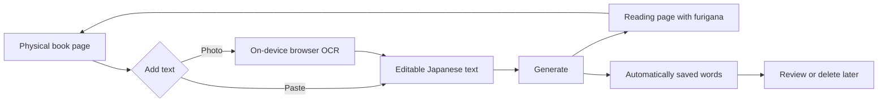

# Japanese Reading Support — Product and Design Guide

## 1. Purpose of this document

This document defines the product direction, interaction design, technical structure, and iteration principles for Japanese Reading Support. It should guide both the current prototype and future development.

Update this document when a product decision changes. Implementation details that may change frequently should remain in code comments or separate technical documentation.

## 2. Product definition

Japanese Reading Support is a mobile-first web app that helps Japanese learners read physical Japanese books with fewer interruptions.

Before or during reading, the user obtains text from a physical page by:

- copying it with a phone feature such as Apple Live Text;
- pasting text copied from another source; or
- taking or selecting a photograph and using the app's OCR.

The app analyzes the text, adds hiragana furigana to words containing kanji, and presents the result as a clean reading page. Kanji-containing words are collected automatically for optional review after reading.

The primary goal is reading continuity, not vocabulary memorization. The app should help the user return attention to the physical book as quickly as possible.

### Product promise

> Turn a physical Japanese page into a readable furigana reference with minimal effort.

## 3. Target users

The primary user is a Japanese learner who:

- can understand some Japanese but does not know every kanji reading;
- reads physical novels, essays, manga, textbooks, or other printed material;
- uses a phone beside the book;
- wants reading support without repeatedly opening a dictionary; and
- values immersion more than creating a perfectly curated study deck.

The current product is optimized for personal, single-device use. Multi-user accounts and cross-device synchronization are possible future features, not current requirements.

## 4. Product principles

### 4.1 Reading comes first

Every important action should reduce interruption during reading. Vocabulary management, statistics, and study features must not make the reading workflow slower.

### 4.2 Capture first, correct when necessary

OCR will never be perfect. Recognized text must remain editable before furigana is generated. The app should make correction possible without requiring the user to review every character.

### 4.3 Save automatically, curate later

The user should not have to choose words while reading. All useful kanji-containing words are collected automatically. Deletion and organization happen later on the Words screen.

### 4.4 Mobile by default

Design decisions should assume a narrow touchscreen, one-handed use, intermittent connectivity, and a phone resting beside a physical book. Desktop support is useful but secondary.

### 4.5 Local and private by default

Book photographs, recognized text, and saved words should remain on the device unless the user explicitly enables export or synchronization. Any future cloud feature must clearly explain what data leaves the device.

### 4.6 Progressive complexity

The first successful reading should require no account and as few decisions as possible. Advanced settings should appear only when they solve a demonstrated problem.

## 5. Core user journey



The critical path is:

1. Add text.
2. Generate furigana.
3. Consult the Reading screen while continuing the physical book.

Reviewing saved words is a secondary, post-reading path.

## 6. Information architecture

The app behaves like a three-screen phone app while remaining one web page internally.

### 6.1 Text screen

Purpose: acquire and prepare Japanese text.

Current capabilities:

- paste from the clipboard;
- manually enter or edit text;
- take a photo or choose an existing image;
- choose horizontal or vertical Japanese OCR;
- preview the selected image;
- display OCR and tokenizer status; and
- generate the reading page.

After successful generation, the app should open the Reading screen automatically.

### 6.2 Reading screen

Purpose: provide a quiet reference while the user reads the physical book.

Current capabilities:

- show the original text with furigana;
- show or hide furigana; and
- increase or decrease reading text size.

This screen should remain visually calm. Future controls should not compete with the text.

### 6.3 Words screen

Purpose: allow optional cleanup and review after reading.

Current capabilities:

- show automatically extracted kanji-containing words and readings;
- avoid duplicate entries with the same written form and reading;
- delete individual entries; and
- clear the complete saved-word list.

The Words screen is not intended to become the main experience. Features such as flashcards or quizzes should be evaluated as separate modes or integrations.

### 6.4 Navigation

Users can move between screens using:

- the persistent bottom navigation;
- a left swipe to move forward;
- a right swipe to move backward; and
- browser back and forward navigation through URL hashes.

Swipe navigation should not activate when a gesture begins on a text field, selector, link, or button. Each screen preserves its scroll position when the user changes screens.

## 7. Interaction and visual design

### Layout

- Use a single-column layout.
- Keep primary content within a readable maximum width on larger screens.
- Respect iOS and Android safe areas around the header and bottom navigation.
- Keep important controls reachable without precise tapping.
- Use at least approximately 44 × 44 CSS pixels for primary touch targets when practical.

### Typography

- Prefer system Japanese fonts for fast loading and familiar glyph shapes.
- Reading text should be larger and have generous line height to make room for ruby text.
- Furigana should be visually secondary but remain legible.
- Preserve original whitespace and line breaks when presenting reading text.

### Feedback

- Long-running OCR must show recognizable progress.
- Disabled controls should communicate when a required model is not ready.
- Errors should explain how the user can recover, for example by taking a brighter or straighter photograph.
- Destructive actions require confirmation.

### Accessibility

- Navigation must remain usable without swipe gestures.
- Interactive elements need descriptive labels.
- Active screen state should be exposed with appropriate ARIA attributes.
- Reduced-motion preferences should disable page animation.
- Color must not be the only indication of important state.

## 8. Current technical architecture

The prototype is intentionally implemented as one static `index.html` file. It does not require a build system or application server and can be hosted directly on GitHub Pages.

### Components

| Component | Current implementation | Responsibility |
| --- | --- | --- |
| UI | HTML and CSS in `index.html` | Three-screen mobile interface |
| Navigation | Vanilla JavaScript and URL hashes | Screen switching, swipe gestures, history |
| Japanese analysis | Kuromoji loaded from jsDelivr | Tokenization and word readings |
| Photo recognition | Tesseract.js loaded from jsDelivr | Horizontal or vertical Japanese OCR |
| Furigana rendering | DOM `ruby` and `rt` elements | Reading-page presentation |
| Word storage | Browser `localStorage` | Persistent saved words on one browser/device |
| Hosting | Static hosting; GitHub Pages recommended | HTTPS delivery without a backend |

### Processing pipeline

1. The user provides text directly or selects a photograph.
2. Tesseract.js recognizes Japanese text from the photograph in the browser.
3. The recognized text is inserted into the editable text area.
4. Kuromoji tokenizes the submitted Japanese text.
5. The app preserves gaps, punctuation, spaces, and line breaks from the source.
6. Suitable adjacent hiragana tokens are merged with kanji tokens as okurigana.
7. Tokens with kanji and a known reading are rendered with furigana.
8. Those tokens are merged into the saved-word collection.

### External dependencies

The current app loads Kuromoji, its dictionary, Tesseract.js, and OCR language data from content delivery networks. Therefore:

- the first use requires an internet connection;
- OCR and tokenization availability depend on third-party resources; and
- dependency versions should remain pinned and be tested before upgrades.

Offline support will require caching or bundling these assets. The Japanese models are relatively large, so storage and initial-download costs must be considered.

## 9. Data model and persistence

Saved words use the browser storage key:

```text
furigana-reading-support-saved-words
```

Each saved word currently contains:

```text
id             written form + reading
surface        visible word from the text
reading        hiragana reading
dictionaryForm dictionary or merged visible form
partOfSpeech   Kuromoji part of speech, when available
createdAt      first saved timestamp
lastSeenAt     most recent occurrence timestamp
deleted        soft-deletion state
```

Words with the same `surface` and `reading` share an ID and are not duplicated. Encountering a previously deleted word restores it and updates `lastSeenAt`.

### Current persistence limitations

- Data belongs to one browser profile and one website origin.
- Local preview data does not automatically transfer to GitHub Pages.
- Phone and desktop word lists are independent.
- Private browsing or cleared website data may remove the list.
- There is currently no backup, export, import, or synchronization.

### Storage direction

Continue using local storage as the primary source for the near term because it is immediate, private, and works without an account. The preferred evolution is:

1. Add CSV export and import for backup and Google Sheets compatibility.
2. Consider IndexedDB if reading sessions, source text, images, or substantially more data must be stored.
3. Add optional authenticated cloud synchronization only when cross-device use becomes a validated need.

Do not embed Google API credentials or other secrets in `index.html`. A public product that supports synchronization should use a backend and a proper database rather than Google Sheets as its primary database.

## 10. Privacy and content handling

Physical pages may contain copyrighted or personally sensitive content. The product should minimize collection.

Current intended behavior:

- OCR executes inside the browser.
- Selected photographs are previewed through a temporary object URL.
- Photographs are not intentionally uploaded or permanently saved by the app.
- Recognized source text is not currently persisted after the page is closed.
- Extracted words are stored locally.

Before adding analytics, cloud OCR, synchronization, or error reporting, document exactly what text or image data is transmitted and obtain meaningful user consent.

## 11. Error and edge-case policy

The app should fail in a way that preserves the user's ability to continue reading.

Important cases include:

- OCR finds no text;
- vertical text is processed with the horizontal model or the reverse;
- the page is curved, shadowed, blurred, or contains multiple columns;
- OCR inserts incorrect punctuation, spaces, or similar-looking kanji;
- Kuromoji or its dictionary fails to download;
- a token has no reading;
- clipboard permission is denied;
- local storage is unavailable or full; and
- third-party CDN resources cannot be reached.

When processing fails, retain the user's input and offer a retry or manual-editing path. Never clear source text automatically after an error.

## 12. Scope boundaries

### Current scope

- Mobile web experience
- Text paste and manual editing
- Photograph selection and Japanese OCR
- Furigana generation
- Reading display controls
- Automatic local word collection
- Simple word deletion

### Explicit non-goals for the current stage

- A native iOS or Android application
- Full dictionary definitions and translations
- Spaced-repetition scheduling
- Social features
- Public sharing of photographed book pages
- Perfect OCR or linguistic analysis
- User accounts and subscriptions
- Google Sheets as the primary application database

Non-goals can change, but only after they support the central reading experience or a validated user need.

## 13. Iteration priorities

### Phase 1 — Make the core loop dependable

- Test the complete workflow on iPhone and Android.
- Improve OCR recovery guidance and text correction.
- Verify vertical-book layouts and common page conditions.
- Improve furigana accuracy and okurigana grouping.
- Add empty, loading, and failure states where needed.
- Confirm that navigation and reading controls are comfortable one-handed.

### Phase 2 — Make it feel installable and safe

- Add a web app manifest and application icons.
- Add Home Screen installation guidance.
- Add a service worker where useful.
- Decide which assets can reasonably work offline.
- Add CSV export and import for the word list.
- Add an understandable local-data and privacy explanation.

### Phase 3 — Support longer reading sessions

- Preserve recent reading sessions locally.
- Allow multiple page captures within a session.
- Add optional word search, sorting, and filtering.
- Track encounter count without turning reading into a study task.
- Evaluate a reading-focused vertical presentation mode.

### Phase 4 — Optional synchronization

- Validate demand for multi-device access.
- Define account, authentication, deletion, and privacy requirements.
- Select a backend and database appropriate for user data.
- Keep local-first behavior and make synchronization optional.

## 14. How to evaluate a proposed feature

Before adding a feature, answer these questions:

1. Does it help the user start or continue reading more smoothly?
2. Which screen and stage of the reading journey owns it?
3. Does it add a decision or delay to the critical path?
4. Can it remain optional or appear only after reading?
5. What happens when the network or feature fails?
6. Does it send or persist book content or personal data?
7. Is the benefit worth the added interface and maintenance complexity?
8. How will success be observed without collecting sensitive reading content?

A feature that mainly supports memorization should normally be placed after the reading flow or exported to a dedicated study tool.

## 15. Success criteria

The product is successful when a learner can:

- obtain usable text from a physical page with little preparation;
- reach a furigana reading page quickly;
- consult readings without losing their place in the book;
- continue even when OCR makes small mistakes;
- finish a session without managing vocabulary during reading; and
- optionally review or export collected words afterward.

Useful future measures include time from opening the app to displaying furigana, generation success rate, OCR retry rate, and continued use across reading sessions. Avoid collecting the source book text merely to measure these outcomes.

## 16. Decision record

| Decision | Reason | Status |
| --- | --- | --- |
| Build a mobile-first web app instead of a native app | Faster iteration and simple distribution through a URL | Active |
| Use three app-like screens inside one HTML page | Separates tasks while keeping deployment simple | Active |
| Support both paste and photo input | Physical-book text is not always available through copy and paste | Active |
| Generate furigana only for kanji-containing tokens | Keeps the reading display focused and reduces unnecessary annotation | Active |
| Save words automatically | Avoids interrupting the reading session | Active |
| Store words locally first | Provides privacy and avoids account/backend complexity | Active |
| Keep Google Sheets as an export or optional integration | Direct client integration adds authentication and security complexity | Proposed |
| Use GitHub Pages for the prototype | The app is static and benefits from simple HTTPS hosting | Proposed |

When a decision changes, add a new row or update its status and explain the replacement. Do not silently remove historical product reasoning.
